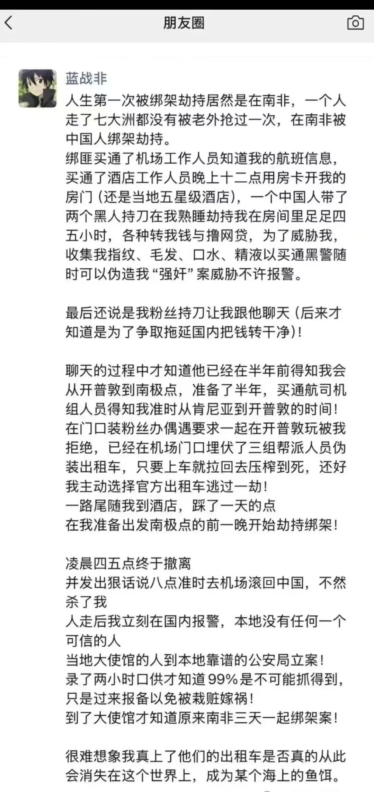

<!-- truncate -->

蓝战非在南非被绑架了…
具体经过如下。

被人拿到了具体的行程，劫匪跟五星级酒店的员工串通好，在晚上 12 点酒店内被国人和两个黑哥抢了…这件事情我觉得最魔幻的一个点，就是蓝战非也去过很多更乱更差的地方，结果在南非被中国人做局，这一波应该是把所有流动资金都转走了，少说得有几百个吧…
在这些国家，要提防预谋了这么久的抢劫，根本提防不了吧。买通了机组人员拿到行程，买通酒店人员帮忙开门。只能说还留了蓝战非一条命，也还算幸运了。

……

美股自从四月份的大跌之后，科技公司频频新高。从四月份最低点开始算，苹果涨幅 62%，谷歌涨幅 96%，英伟达涨幅 96%，美光这些内存厂商更是达到了 280% 的涨幅…我是能理解这些公司都是优质公司，但是从没想过他们能涨幅如此夸张，毕竟很多都是万亿市值的公司。可惜我都不在车上。果然，相信国运，定投纳斯达克。

最近有在频繁使用 gemini，Google AI studio，notebookLM。等后面再整理出一期分享。使用下来，觉得这些都是跨时代的产品。实在太好用了。

……

港股 IPO(打新), 上了 hashkey，香港的合规 web3交易所，不过他不是唯一一家，搜了一下还有一家叫做 OSL Exchange 的，已经在港股上市了，他们是仅有的两家目前合规的交易所。不过可惜的是需要香港身份才能开这两家交易所。

聊聊这次的定价，以及热度。上一次 web3公司 IPO，我印象中还是 CRCL，即 USDC 的母公司，CRCL 定价 31 美刀，上市第一天涨到 127，最高涨到298。 不过当时不在港股上市，只有美国人才能打。

这次 hashkey 定价上下限为5.95港元至6.95 港元，发行 2.1 亿股，这次 IPO 发行的 2.41 亿股仅占公司总股本的约 8.7%，最高募资6.95 * 241000000 ≈ 16.73亿港元 ，预估市值在164.5亿 - 192.2亿港元之间。基石占比 37.65%, 意思就是有 37.65 % 的发售股份被锁定， 算是占比比较大的。 

坏消息是，今年 hashkey 亏损5.06亿，过去三年都是亏损的。我们用 市销率 (P/S) 来算笔账（因为都没盈利，看 PE 没意义）。Coinbase，美国合规龙头，P/S 大概在 9-10倍 。 而HashKey，按2024年营收算，P/S 高达 25-30倍。OSL，P/S 也很高，大概 30倍 左右。并且目前定价的 hashkey 市值跟 OSL 同个量级，都是在 150 亿上下。
HashKey 是个好资产（稀缺牌照），但这次 IPO 的价格定得一点都不便宜，个人评分 7 颗星。

以上