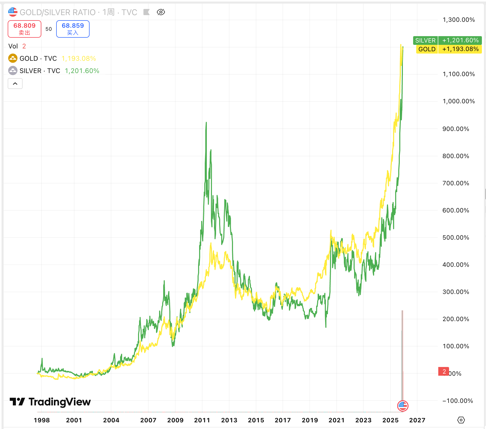
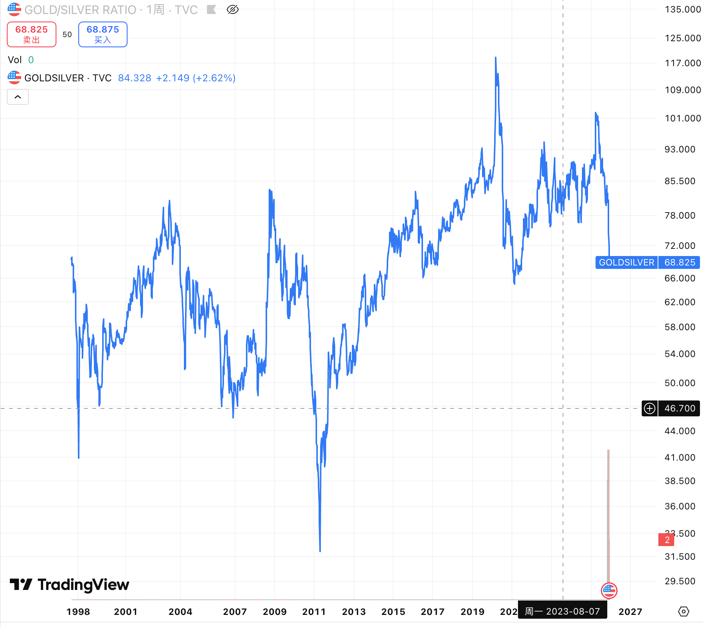

这两年由于美联储降息、局势动荡，金价，银价这些大宗商品疯涨，银价从今年开始算累计涨幅 102%。金价也是卡在 4000 关口来回波动。从图中的图可以看出来，金价和银价的涨跌很类似。

从2000 年开始计算，金价涨了13倍，银价涨了10倍，不过其实在 2012年 到 2018年期间其实都没有多大的涨幅，一直在上下波动，直到这几年才开始疯涨。并且目前主流机构对黄金的看法都非常乐观，大摩看向 4500，高盛看向 4900，花旗预期明年年底到达 5000美元/盎司。华尔街基本一致认为金价在未来两年都会站上4000 - 5000 高位。

金价和银价的涨跌并不是完全同频的。比如金价在今年涨了接近 50%， 而银价涨了 100%。其中一个原因是他们两者的市值完全不是一个量价。黄金总市值接近 30 万亿美金，白银只有2.7万亿美金。白银相对来说更容易被操控，历史上也确实出现过操控银价的事情。详细可以搜索“上世纪80年代亨特兄弟白银操纵事件”。

这里还涉及到一个金银比的概念，现代历史上，高位 (&gt;80)： 说明黄金太贵，白银太便宜。低位 (&lt;40)： 说明白银过热，可能相对于黄金太贵了。

金银比的平均值大约在 50-60 之间。目前的金银比是 68，在今年四月份的时候，这个比值达到了 104，马后炮来讲，当时是一个非常不错的投资机会。2020年疫情爆发时，金银比一度飙升到 120（历史极值）。目前这个比值可能还会降，就看是分子跌，还是分母涨了。

很巧的是，我写这篇文章的时候是下午七八点，回到家一看猫笔刀也提到了金银比，金价银价, 哈哈。

......

关于一些毛子的趣闻。自从毛子跟乌克兰开始打仗，2022 之后，西方国家把毛子的外汇冻结了，并且也不允许再向毛子出口影视作品。但是毛子直接通过一些手段，找其他国家借了片源，在他们境内随便上映，比如疯狂动物城2，并且收入也不用跟迪士尼分成。而且不仅是影视作品，在盗版游戏这些地方也是全球独一档，比如
Byrutor、RuTracker，这些都可以通过 bit 种子下载各种游戏、影视、资源。

盗版届没了毛子，就像西方没了耶路撒冷。

对了，12月12日 Epic 会在圣诞节开始送游戏，连送十多款，囤囤党们可以开始期待了。忘了大学哪一年， Epic 给我送了 GTA5，给我激动坏了，结果电脑带不动。当时还没有显卡这种概念，用核显在跑 GTA5，崩溃了五六次都觉得是不是跟内存有关系。等到后面真的配置了游戏本，却没怎么打开过 GTA5 了。

......

聊一下关于前段时间发生的 React Next.js 的安全事故，个人感觉严重程度跟之前的服务器 Log4j 可以归为一个级别的，CVSS 评分10分满分。都是黑客可以无需登陆直接获取系统文件权限，能访问内网数据库，持有 API 密钥。

简单查看了一下攻击手法，其实构造这个请求应该不复杂，只需要不发送 `<html>` 这类正常的组件数据，改为发送 child_process 之类的 node对象，导致服务器反序列化了病毒代码。只是 AI 由于安全原因不帮我构造，不然我高低实验一下 (尬笑...)。

不过有一个博主确实说他被攻击了，程序员鱼皮，有兴趣可以看一下他的视频，这个攻击的严重性比我想象中要严重得多。以后后端、安全相关的坑，在 Next.js 这些全栈框架上面可能会一个不落的踩一遍...

......

哦对了，还有一个涨疯了的股票。大 a 的摩尔线程。

一个星期前上市，第一天涨了四倍，打中一手净赚 25 万，更夸张的时候到今天，他还在涨。上市第一天收盘价 600 ，今天已经涨到 850 了，勇敢者和有钱人的游戏，毕竟一手就要 17w。

不过他的打新门槛也很高，需要持有科创板股票大于 1 万元并且日均资产大于 50 万，总体中签概率是万分之三。

不过实际上，作为国内的顶尖显卡厂商，很多人其实没怎么听过他们系列的显卡。他们消费级别的显卡，按照硬件性能应该处在 RTX-3050 左右的级别，这个是 2022 年发布的显卡了，不过好处是显存大，有16GB。而算力级别的显卡，定位是对标 NVDIA A10，这个是2021年发布的显卡。摩尔现场的老总之前是英伟达的中国区总经理，基本是按照英伟达那一套技术络线照抄过来的。总体落后5年左右，不过这两年英伟达的新技术都没得抄了，任重而道远。

以上。

